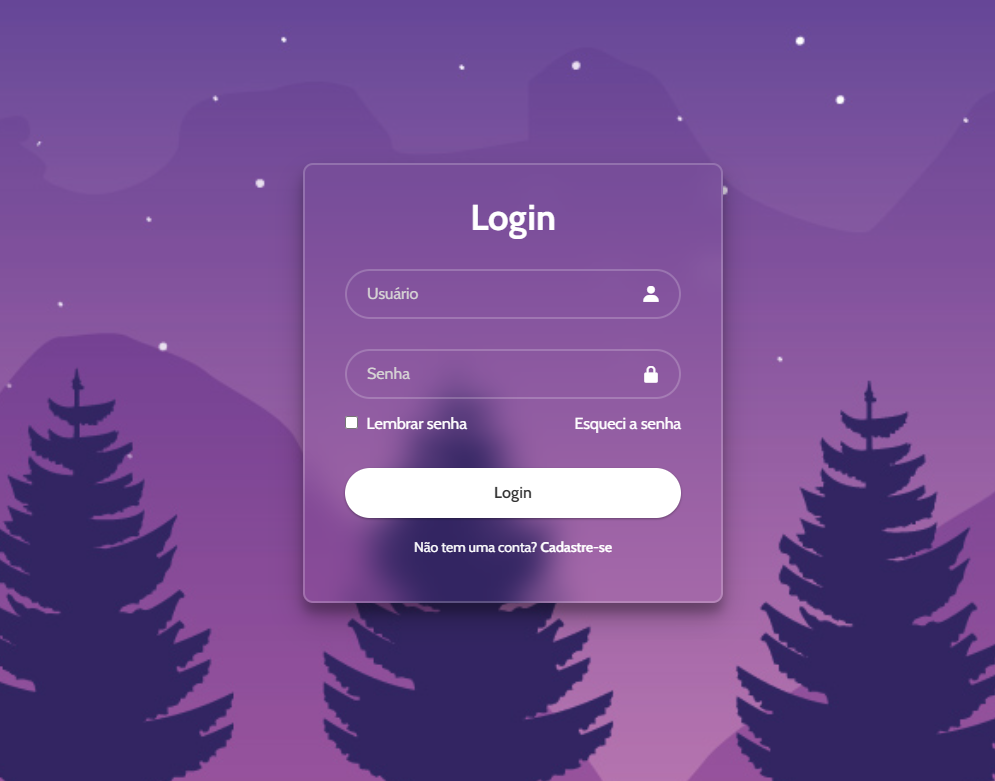

# Tela de Login 

Projeto simples de uma tela de login com HTML e CSS, inspirado no estilo glassmorphism. Conta com campos de e-mail, senha, opção de lembrar senha, link de recuperação e botão de cadastro.

## Tecnologias

- HTML5  
- CSS3  

## Captura de Tela

## Como usar

1. Clone o repositório

- git clone https://github.com/rickportela/projeto-login.git

2. Abra o index.html em seu navegador.

## Possíveis melhorias

    - Validação de formulário via JavaScript

    - Responsividade para dispositivos móveis

    - Integração com back-end

    - Animações de transição

##  Autor
Desenvolvido por Rickson Portela,
Estudante de Análise e Desenvolvimento de Sistemas.
